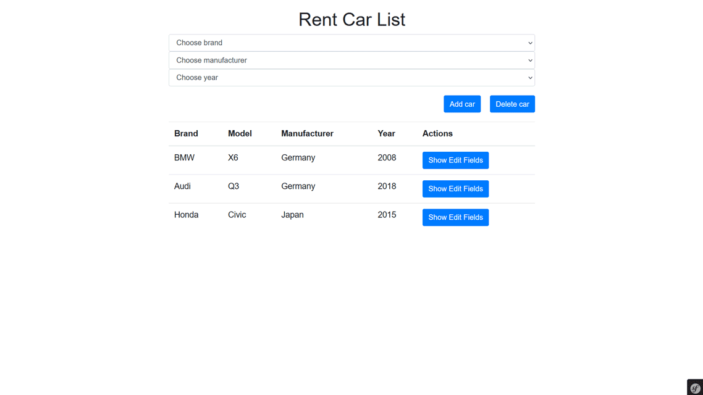

# Rent_Car_List using Symfony Framework
This is a simple project of cars list using Symfony in which you can add, edit and delete a car and filter the cars' list by brand, manufacturer and year.
# By doing this project I learned:
- how to install Doctrine;
- how to configure the database;
- how to create database using Doctrine;
- how to create an Entity Class;
- how to make a migration using DoctrineMigrationsBundle;
- how to add a new field property;
- how to make a controller;
- how to creating Form Types Based on Symfony Built-in Types;
- how to check if form is submitted and valid;
- how to enter an object into the database as a result of the flush operation;
- how to remove an object instance as a result of the flush operation;
- how to add a flash message to the current session for type;
- how to redirect the user to another page.
# Features
- Form for adding cars' info;
- Form for editing car's info;
- Form for deleting cars' info;
- Filter cars' list by brand, manufacturer and year
# Instructions
To start the project:
- Download and install <code>Composer</code>: https://getcomposer.org/download/;
- Set <code>composer.bat</code> file to the PATH system variables;
- Type this in console terminal of the project folder:
```
composer install
```
- Install <code>yarn</code> globally in your Windows OS. Type this in console terminal:
```
npm install -g yarn
```
- In the project folder execute the three commands below to generate the <code>manifest.json</code> file;
```
yarn add --dev @symfony/webpack-encore
yarn add webpack-notifier --dev
yarn encore dev
```
- Open your console terminal, move into your project directory and start the local web server as follows:
```
symfony server:start
```
- Type the URL below to start the project:
```
localhost:8000/rentCar/home
```
- Test the application.
# Demo

